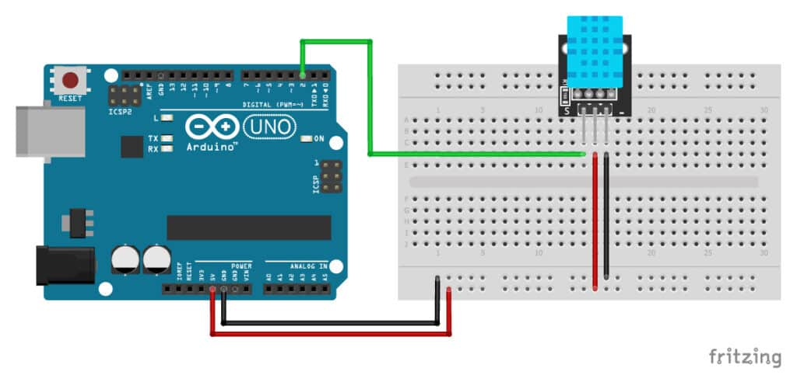

# ESP8266 DHT11 Web Server

This project uses an **ESP8266** (e.g., NodeMCU) and a **DHT11** sensor to measure temperature and humidity and display the data on a **web page**. The page is responsive, automatically refreshes every 10 seconds, and visually highlights values with colors based on the measured ranges.

---

## Features

- Connect ESP8266 to a WiFi network with SSID and password
- Web server running on ESP8266 (port 80)
- Display current **temperature and humidity** in a clear table
- Automatic page refresh every 10 seconds
- Color-coded values:
  - **Temperature (°C)**
    - < 20 → blue
    - 20–24 → green
    - 25–27 → orange
    - > 27 → red
  - **Humidity (%)**
    - < 30 → orange
    - 30–60 → green
    - > 60 → blue
- Serial Monitor displays WiFi status, IP address, and DHT11 readings

---

## Hardware Requirements

- ESP8266 (NodeMCU or d1 mini)
- DHT11 sensor
- Jumper wires
## Img (replace Arduino nano with d1 mini)

---

## Wiring

| DHT11 Pin | ESP8266 Pin |
|-----------|-------------|
| VCC       | 3.3V / 5V   |
| GND       | GND         |
| Data      | D2 (GPIO4)  |

---

## Installation

1. Install **Arduino IDE** with **ESP8266 board support**.
2. Install the following libraries via Library Manager:
   - `DHT sensor library` by Adafruit
   - `ESP8266WiFi`
   - `ESP8266WebServer`
3. Configure WiFi credentials in the code:
   ```cpp
   const char* ssid = "YOUR_SSID";
   const char* password = "YOUR_PASSWORD";
